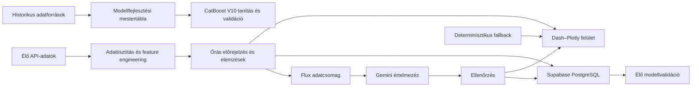

# OkosMérő

**Automatizált villamosenergia-adatelemző, fogyasztás-előrejelző és energiapiaci döntéstámogató rendszer**

Az OkosMérő az MVM DataInsight diplomamunkából továbbfejlesztett, nyilvánosan elérhető energiaadat-platform. A rendszer több külső adatforrásból származó fogyasztási, energiapiaci, időjárási, árfolyam- és megújulóenergia-adatot integrál, majd ezekből órás fogyasztási előrejelzést, day-ahead árelemzést, megújulóenergia-monitoringot és anomáliavizsgálatot készít.

A projekt nem egyszeri modellkísérlet, hanem teljes adat- és alkalmazási folyamat: a historikus adatok feldolgozásától és a modellfejlesztéstől az élő API-kapcsolatokon át az előrejelzések tartós tárolásáig, visszaméréséig és közérthető értelmezéséig.

**Élő alkalmazás:** https://okosmero.onrender.com

---

## Fő képességek

- Órás villamosenergia-fogyasztási előrejelzés CatBoost modellel
- Negyedórás day-ahead villamosenergia-árak elemzése
- Kedvező, összefüggő töltési időszakok azonosítása
- Nap- és szélerőművi előrejelzések összevetése a mért termeléssel
- STL-alapú anomáliadetektálás és kontextusalapú kategorizálás
- Napi és heti élő modellvalidáció
- Supabase PostgreSQL-alapú előrejelzési és anomálianapló
- Többforrású adatlekérés, gyorsítótárazás és tartalék adatforrások
- **Flux** intelligens asszisztens az élő eredmények természetes nyelvű értelmezéséhez

---

## Rendszerarchitektúra

Az OkosMérő három, egymástól világosan elkülönített adatrétegre épül.



### 1. Historikus modelladatbázis

A modell fejlesztéséhez használt historikus adatállomány automatizált Python-adatpipeline-nal készült.

A 2015–2026 közötti ENTSO-E terhelési lekérés több mint **400 000 nyers negyedórás időpontot** eredményezett. A tisztítás, időzóna-egységesítés, duplikációkezelés és órás aggregálás után létrejött modellfejlesztési mestertábla:

- **100 549 órás rekord**
- **21 alapváltozó**

| Forrás | Felhasználás |
|---|---|
| ENTSO-E Transparency Platform | fogyasztás, day-ahead árak, nap- és szélenergia-adatok |
| Open-Meteo | historikus órás időjárási adatok |
| ECB | EUR/HUF árfolyam |
| Magyar ünnepnap-adatok | naptári és ünnepnapi jellemzők |

A mestertábla a modell tanítását, feature engineeringjét és offline validációját szolgálja. Nem azonos az alkalmazás működése közben folyamatosan frissülő élő adatfolyammal.

### 2. Élő adatpipeline

Az éles alkalmazás minden frissítési ciklusban közvetlenül lekéri a működéshez szükséges aktuális adatokat. A rendszer automatikusan kezeli:

- a magyar villamosenergia-rendszer mért terhelését
- a hivatalos terhelési előrejelzést
- a publikált day-ahead villamosenergia-árakat
- a nap- és szélerőművi termelési előrejelzéseket
- a mért nap- és széltermelést
- az órás időjárási adatokat
- az EUR/HUF árfolyamot
- a naptári és ünnepnapi információkat

**Az élő adatfolyam lépései**

1. API-adatok lekérése
2. Időpontok egységesítése Europe/Budapest időzónára
3. Adatelérhetőség és adatminőség ellenőrzése
4. A modell bemeneti jellemzőinek előállítása
5. Órás előrejelzés és elemzések elkészítése
6. A Dash-felület frissítése
7. Az előrejelzések mentése
8. Visszamérés a lezárt tényadatok beérkezése után

### 3. Operatív Supabase PostgreSQL-adatbázis

A Supabase PostgreSQL nem a historikus tanítási mestertábla helyettesítője, hanem az éles rendszer működését, visszamérését és auditálhatóságát biztosítja.

#### `forecast_pending`

A még jövőbeli célórákhoz tartozó előrejelzéseket tárolja. Célóránként megőrzi:

- az első CatBoost-jóslatot
- a legfrissebb CatBoost-jóslatot
- az előrejelzés időpontját és horizontját
- a modellverziót
- a bemeneti adatok minőségi állapotát
- az adatforrás típusát

#### `forecast_log`

A lezárt órák végleges validációs rekordjait tartalmazza. Egy célóra akkor kerül a végleges naplóba, amikor rendelkezésre áll a korábban mentett CatBoost-előrejelzés és a lezárt tényleges fogyasztási adat. A rendszer ekkor kiszámítja az abszolút hibát, valamint külön az első és a legfrissebb jóslat hibáját.

A lezárt rekordok utólag nem módosulnak, így az éles teljesítmény időben követhető és auditálható.

#### `stl_anomalia`

Az STL-módszerrel azonosított eltéréseket és azok magyarázó környezetét tárolja: tényleges és várt fogyasztás, reziduum, hőmérséklet, szélsebesség, napsugárzás, csapadék, day-ahead ár, napszak, hétvége- és ünnepnapjelző, anomáliakategória.

---

## Fogyasztás-előrejelzés — CatBoost V10

Az éles rendszer fogyasztás-előrejelző modellje a **CatBoost V10**. A modell közvetlenül készít órás előrejelzéseket: nem a saját korábbi jóslatát használja a következő célóra bemeneteként. A rendelkezésre álló élő forrásadatoktól függően legfeljebb **24 órás előrejelzési horizontot** állít elő.

<details>
<summary><b>Felhasznált jellemzőcsoportok</b></summary>

**Fogyasztási előzmények**
- 24, 48, 72, 96, 120, 144, 168 és 336 órás késleltetések
- Az előző hetek azonos óráinak átlaga, mediánja, minimuma és maximuma
- Rövid és heti fogyasztási trendek

**Időjárási jellemzők**
- Hőmérséklet, páratartalom, napsugárzás, szélsebesség, csapadék
- Fűtési és hűtési fokértékek

**Energiapiaci és megújulóenergia-jellemzők**
- Day-ahead ár és árkülönbségi jellemzők
- Napenergia- és szélenergia-előrejelzés
- EUR/HUF árfolyam

**Idő- és naptárjellemzők**
- Óra, hét napja, hónap, hétvége, ünnepnap
- Napi, heti és éves ciklikus jellemzők
- Extrém hideg- és melegjelzők

</details>

### Offline validáció

| Mutató | CatBoost V10 |
|---|---|
| MAE | 108,48 MWh |
| MAPE | 2,50% |

A dokumentáció kizárólag a kiválasztott éles modell ellenőrzött eredményeit mutatja be; az elvetett köztes modellváltozatok nem részei a rendszerleírásnak.

### Élő validáció

Az offline értékelést folyamatos éles visszamérés egészíti ki. Az operatív adatbázis alapján az alkalmazás megjeleníti a napi MAE-t, a heti kumulált hibákat, a legjobb és legnehezebb előrejelzési órát, valamint az első és a legfrissebb jóslat eredményét.

---

## STL-alapú anomáliadetektálás

Az OkosMérő robusztus STL-dekompozícióval bontja fel a fogyasztási idősort **trendre**, **napi szezonális mintázatra** és **reziduumra**. A ±2,5 szórásos küszöbön kívül eső reziduumokat anomáliaként kezeli, és a rendelkezésre álló időjárási és energiapiaci környezet alapján kategorizálja:

- időjárási extrém
- alacsony napsugárzáshoz kapcsolódó nappali eltérés
- jelentős, 24 órán belüli hőmérsékleti fordulat
- további vizsgálatot igénylő eltérés

Az anomáliák a felületen és a Supabase-adatbázisban egyaránt megjelennek.

---

## Flux — élő adatokra épülő intelligens asszisztens

Flux az OkosMérő főoldalán működő értelmezési réteg: a rendszer technikai eredményeit közérthető, természetes nyelvű összefoglalókká alakítja, és válaszol az alkalmazás adataival kapcsolatos kérdésekre.

### Élő adatokon alapuló válaszadás

Flux nem előre eltárolt válaszokból dolgozik. A kérdés pillanatában a Gemini **strukturált adatcsomagban** kapja meg az OkosMérő aktuális eredményeit — mért és előrejelzett fogyasztás, day-ahead árak, töltési ajánlás, nap- és szélerőművi adatok, anomáliavizsgálat, adatforrások állapota.

**A nyelvi modell kizárólag az átadott adatcsomag alapján készíthet választ.**

### Gyorsítótárazás

Minden adatállapot egyedi azonosítót kap. Ha ugyanahhoz az adatállapothoz már készült érvényes összefoglaló, a rendszer azt használja fel új Gemini-hívás helyett. Ennek eredménye alacsonyabb API-költség, gyorsabb válaszidő és azonos adatokhoz következetes válasz.

### Auditálható szöveggenerálás

Minden generált összefoglalóhoz rögzül a generálás időpontja, az alapul szolgáló adatállapot azonosítója, a használt modell, a prompt verziója, a válasz típusa és az ellenőrzés eredménye.

| Státusz | Jelentés |
|---|---|
| `gemini` | a Gemini által készített és elfogadott válasz |
| `fallback` | determinisztikus sablonból készült válasz |
| `rejected` | az ellenőrzésen elutasított modellválasz |

### Determinisztikus hibatűrés

A Gemini válasza csak akkor jelenhet meg, ha megfelel az ellenőrzési szabályoknak. Ha a modell nem érhető el, túllépi az időkorlátot, hibás választ ad, **vagy olyan számot használ, amely nincs jelen az adatcsomagban**, a generált válasz nem kerül a felületre — helyette determinisztikus, az élő adatokból programozott szabályokkal összeállított szöveg jelenik meg.

Flux így nem egyszerű chatbot, hanem az OkosMérő ellenőrzött adataira épülő, gyorsítótárazott, auditálható és hibatűrő értelmezési réteg.

---

## Alkalmazásfelületek

| Felület | Tartalom |
|---|---|
| **Főoldal** | A rendszer működése, a legfontosabb aktuális mutatók, Flux összefoglaló és kérdésfeltevés |
| **DAM-árak és töltés** | Negyedórás árak, kedvező töltési időszak, negatív árú időszakok, alternatív töltési ablakok |
| **Energiaelemzés** | Órás előrejelzés, várható minimum- és csúcsterhelés, fogyasztás–hőmérséklet kapcsolat, élő validáció |
| **Megújulók** | Nap- és szélenergia előrejelzés vs. mért termelés, előrejelzési hibák, termelési csúcsok, kapcsolat a DAM-árakkal |
| **ML Modell Labor** | STL-reziduum, anomáliaküszöbök, kategorizált anomáliák, adatminőségi állapot, anomálianapló |

---

## Adatminőség és hibatűrés

Az OkosMérő:

- Europe/Budapest időzónában kezeli az adatokat
- csak teljesen lezárt órát használ tényadatként
- adatforrásonként külön gyorsítótárat alkalmaz
- új nap és day-ahead publikálás után érvényteleníti az elavult gyorsítótárat
- Open-Meteo-hiba esetén Visual Crossing tartalékforrásra vált
- átmeneti API-hiba esetén az utolsó sikeresen lekért valós adatot használja
- megkülönbözteti a teljes, részleges és kritikus adatkapcsolati állapotot
- **nem állít elő kitalált helyettesítő adatot**

---

## Fejlődési út: MVM DataInsight → OkosMérő

Az OkosMérő nem az eredeti diplomamunka átnevezése, hanem annak módszertanilag felülvizsgált és jelentősen kibővített utódja.

<details>
<summary><b>Az előzményrendszer részletei</b></summary>

### Napi és havi adatkészletek

| Adatkészlet | Időszak | Rekordszám |
|---|---|---|
| Havi országos villamosenergia-felhasználás | 2014–2024 | 132 havi rekord |
| Lakossági fogyasztás és rezsi-gap | 2014–2024 | 132 havi rekord |
| Napi országos fogyasztás | 2024–2025 | 731 napi rekord |
| Napi HUPX DAM-ár | 2024–2025 | 731 napi rekord |

Az adattárolási technológia Azure Database for PostgreSQL volt.

### Anomáliadetektálás és trendelemzés

Szezonálisan értelmezett IQR · Isolation Forest · Random Forest osztályozó · SMOTE · precision-, recall- és F1-alapú értékelés · konfúziós mátrix · több módszer közös találatainak vizsgálata.

A trendelemzés a rezsi-gap, az energiaár-olló, a HUPX- és ENTSO-E-árak, az ECB EUR/HUF árfolyam, a KSH háztartásszám-adatok, valamint a hőmérséklet és fogyasztás kapcsolatát vizsgálta.

### PyTorch V1, V2 és kapuzott ensemble

Az első előrejelző modell egy PyTorch neurális háló volt: 9 bemeneti változó, 64 és 32 neuronos rejtett rétegek, ReLU aktiváció, MinMaxScaler, Adam-optimalizáló, MSE-veszteség, 200 epoch.

A célzott hibaanalízis kimutatta, hogy a tanítóhalmazban kevés −5 °C alatti nap szerepelt. Ennek kezelésére **30 adatvezérelt szintetikus extrémhideg-rekord** készült (15 db −5 és −7 °C között, 15 db −7 és −10 °C között), a valós téli adatok hőmérsékleti sávonként számított fogyasztási átlagaira építve.

A V2 modell a bővített tanítóhalmazon készült, és szabályalapú kapuzott ensemble kapcsolta össze a kettőt: −5 °C alatt a V2, felette a V1 adta az előrejelzést. Az értékelést naiv baseline-ok, SARIMA és SHAP DeepExplainer egészítette ki.

### Módszertani felülvizsgálat

A későbbi validáció **adatszivárgást tárt fel** az eredeti predikciós felállásban, ezért a korai, rendkívül magas pontossági eredmények nem használhatók a jelenlegi rendszer teljesítményének igazolására.

A vizsgálat eszközei: időbeli shift-teszt · feature-megvonási teszt · loss-görbék összehasonlítása · SHAP-változófontosság · bootstrap konfidenciaintervallum · Diebold–Mariano-teszt · walk-forward validáció · multi-seed stabilitásvizsgálat.

Ez a felülvizsgálat vezetett az előrejelzési folyamat időben helyes újratervezéséhez.

### CrewAI-alapú automatizáció

Két adatgyűjtő ágens működött saját CrewAI-eszközökkel: **Időjárás Adatgyűjtő** (Open-Meteo) és **Energiatőzsdei Adatgyűjtő** (ENTSO-E day-ahead). A rendszer külön Agenteket, Taskokat és szekvenciális Crew-folyamatot használt, gpt-4o-mini modellel. Az alkalmazás Streamlit-felülettel és Render deploymenttel működött.

</details>

### A jelenlegi rendszer fő előrelépései

| Korábban | Most |
|---|---|
| napi modellezés | órás modellezés |
| 790 napi rekord | 100 549 órás rekord |
| kézi adatbetöltés | automatizált ENTSO-E-adatlekérés |
| — | külön élő adatpipeline |
| PyTorch V1/V2 ensemble | CatBoost V10 éles modell |
| Azure PostgreSQL | Supabase PostgreSQL operatív adatbázis |
| Streamlit | Dash–Plotly webalkalmazás |
| — | tartós előrejelzési és anomálianapló |
| — | Flux természetes nyelvű értelmezési réteg |

---

## Technológiai háttér

**Éles rendszer**
Python · pandas · NumPy · CatBoost · Dash · Dash Bootstrap Components · Plotly · statsmodels · STL · ENTSO-E · Open-Meteo · Visual Crossing · ECB · Supabase PostgreSQL · psycopg · joblib · requests · Gunicorn · Render

**Kutatási és fejlesztési előzmények**
PyTorch · scikit-learn · Random Forest · Isolation Forest · SMOTE · XGBoost · LightGBM · FLAML AutoML · SARIMA · ensemble-modellek · SHAP DeepExplainer · bootstrap konfidenciaintervallum · Diebold–Mariano-teszt · walk-forward validáció · multi-seed validáció · CrewAI · Streamlit · Azure Database for PostgreSQL

---

## Helyi futtatás

**Függőségek telepítése**

```bash
pip install -r requirements.txt
```

**Környezeti változók**

```env
ENTSOE_API_KEY=...
VISUAL_CROSSING_KEY=...
DATABASE_URL=...
```

| Változó | Szerep |
|---|---|
| `ENTSOE_API_KEY` | ENTSO-E adatlekérések |
| `VISUAL_CROSSING_KEY` | tartalék időjárási adatforrás |
| `DATABASE_URL` | Supabase PostgreSQL-kapcsolat |

A `DATABASE_URL` hiányában az alkalmazás futtatható, de az előrejelzési és anomálianaplózás kimarad.

**Indítás**

```bash
python app.py          # fejlesztői mód, 8050 port
gunicorn app:server    # éles indítás
```

---

## AI-native fejlesztési megközelítés

A projekt AI-native fejlesztési munkafolyamatban készült. A rendszertervezési döntések, az adatforrások kiválasztása, a modellezési követelmények, a validációs szabályok, a felhasználói funkciók és a javítási irányok **emberi döntések** alapján születtek. Az implementáció részletes promptutasításokkal, iteratív fejlesztéssel, teszteléssel és ellenőrzéssel valósult meg.

Az MI-támogatás az adatfeldolgozó és API-integrációs kód létrehozását, a feature engineeringet, a modellkísérleteket, az alkalmazáslogikát, az adatbázis-integrációt, a hibakeresést és a dokumentációt segítette.

**Az éles adatlekéréseket nem nyelvi modell végzi:** a Python-alkalmazás közvetlenül kapcsolódik a külső API-khoz. A nyelvi modell a Flux-rétegben kizárólag az alkalmazás által átadott, ellenőrzött adatcsomag értelmezésére szolgál.

---

## Projektstátusz

Az OkosMérő működő, nyilvánosan elérhető rendszer, amely jelenleg:

- automatikusan lekéri és feldolgozza az élő energiarendszeri adatokat
- 100 549 órás historikus mestertáblára épül
- CatBoost V10 modellel órás fogyasztási előrejelzést készít
- day-ahead árakat és töltési lehetőségeket elemez
- nap- és széltermelési előrejelzéseket értékel
- STL-alapú anomáliákat azonosít és naplóz
- folyamatosan visszaméri saját előrejelzéseit a tényleges fogyasztáshoz
- Flux asszisztenssel közérthetően összefoglalja az aktuális eredményeket
