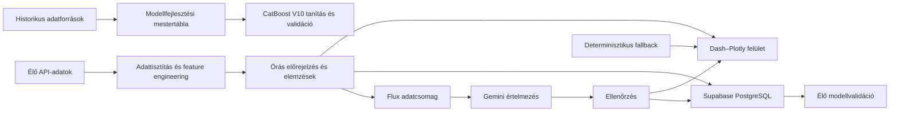

# OkosMérő

**Automatizált villamosenergia-adatelemző, fogyasztás-előrejelző és energiapiaci döntéstámogató rendszer**

Az OkosMérő az MVM DataInsight diplomamunkából továbbfejlesztett, nyilvánosan elérhető energiaadat-platform. A rendszer több külső adatforrásból származó fogyasztási, energiapiaci, időjárási, árfolyam- és megújulóenergia-adatot integrál, majd ezekből órás fogyasztási előrejelzést, day-ahead árelemzést, megújulóenergia-monitoringot és anomáliavizsgálatot készít.

A projekt nem egyszeri modellkísérlet, hanem teljes adat- és alkalmazási folyamat: a historikus adatok feldolgozásától és a modellfejlesztéstől az élő API-kapcsolatokon át az előrejelzések tartós tárolásáig, visszaméréséig és közérthető értelmezéséig.

**Élő alkalmazás:** https://okosmero.onrender.com

---

## Fő képességek

- Órás villamosenergia-fogyasztási előrejelzés CatBoost modellel
- Negyedórás day-ahead villamosenergia-árak elemzése
- Kedvező, összefüggő töltési időszakok azonosítása
- Nap- és szélerőművi előrejelzések összevetése a mért termeléssel
- STL-alapú anomáliadetektálás és kontextusalapú kategorizálás
- Napi és heti élő modellvalidáció
- Supabase PostgreSQL-alapú előrejelzési és anomálianapló
- Többforrású adatlekérés, gyorsítótárazás és tartalék adatforrások
- **Flux** intelligens asszisztens az élő eredmények természetes nyelvű értelmezéséhez
- Nyelvi modell nélkül is működő, determinisztikus szövegképzés és számhitelesítés

---

## Rendszerarchitektúra

Az OkosMérő három, egymástól világosan elkülönített adatrétegre épül.



### 1. Historikus modelladatbázis

A modell fejlesztéséhez használt historikus adatállomány automatizált Python-adatpipeline-nal készült.

A 2015–2026 közötti ENTSO-E terhelési lekérés több mint **400 000 nyers negyedórás időpontot** eredményezett. A tisztítás, időzóna-egységesítés, duplikációkezelés és órás aggregálás után létrejött modellfejlesztési mestertábla:

- **100 549 órás rekord**
- **21 alapváltozó**

| Forrás | Felhasználás |
|---|---|
| ENTSO-E Transparency Platform | fogyasztás, day-ahead árak, nap- és szélenergia-adatok |
| Open-Meteo | historikus órás időjárási adatok |
| ECB | EUR/HUF árfolyam |
| Magyar ünnepnap-adatok | naptári és ünnepnapi jellemzők |

A mestertábla a modell tanítását, feature engineeringjét és offline validációját szolgálja. Nem azonos az alkalmazás működése közben folyamatosan frissülő élő adatfolyammal.

### 2. Élő adatpipeline

Az éles alkalmazás minden frissítési ciklusban közvetlenül lekéri a működéshez szükséges aktuális adatokat. A rendszer automatikusan kezeli:

- a magyar villamosenergia-rendszer mért terhelését
- a hivatalos terhelési előrejelzést
- a publikált day-ahead villamosenergia-árakat
- a nap- és szélerőművi termelési előrejelzéseket
- a mért nap- és széltermelést
- az órás időjárási adatokat
- az EUR/HUF árfolyamot
- a naptári és ünnepnapi információkat

**Az élő adatfolyam lépései**

1. API-adatok lekérése
2. Időpontok egységesítése Europe/Budapest időzónára
3. Adatelérhetőség és adatminőség ellenőrzése
4. A modell bemeneti jellemzőinek előállítása
5. Órás előrejelzés és elemzések elkészítése
6. A Dash-felület frissítése
7. Az előrejelzések mentése
8. Visszamérés a lezárt tényadatok beérkezése után

### 3. Operatív Supabase PostgreSQL-adatbázis

A Supabase PostgreSQL nem a historikus tanítási mestertábla helyettesítője, hanem az éles rendszer működését, visszamérését és auditálhatóságát biztosítja.

#### `forecast_pending`

A még jövőbeli célórákhoz tartozó előrejelzéseket tárolja. Célóránként megőrzi:

- az első CatBoost-jóslatot
- a legfrissebb CatBoost-jóslatot
- az előrejelzés időpontját és horizontját
- a modellverziót
- a bemeneti adatok minőségi állapotát
- az adatforrás típusát

#### `forecast_log`

A lezárt órák végleges validációs rekordjait tartalmazza. Egy célóra akkor kerül a végleges naplóba, amikor rendelkezésre áll a korábban mentett CatBoost-előrejelzés és a lezárt tényleges fogyasztási adat. A rendszer ekkor kiszámítja az abszolút hibát, valamint külön az első és a legfrissebb jóslat hibáját.

A lezárt rekordok utólag nem módosulnak, így az éles teljesítmény időben követhető és auditálható.

#### `stl_anomalia`

Az STL-módszerrel azonosított eltéréseket és azok magyarázó környezetét tárolja: tényleges és várt fogyasztás, reziduum, hőmérséklet, szélsebesség, napsugárzás, csapadék, day-ahead ár, napszak, hétvége- és ünnepnapjelző, anomáliakategória.

---

## Fogyasztás-előrejelzés — CatBoost V10

Az éles rendszer fogyasztás-előrejelző modellje a **CatBoost V10**. A modell közvetlenül készít órás előrejelzéseket: nem a saját korábbi jóslatát használja a következő célóra bemeneteként. A rendelkezésre álló élő forrásadatoktól függően legfeljebb **24 órás előrejelzési horizontot** állít elő.

<details>
<summary><b>Felhasznált jellemzőcsoportok</b></summary>

**Fogyasztási előzmények**
- 24, 48, 72, 96, 120, 144, 168 és 336 órás késleltetések
- Az előző hetek azonos óráinak átlaga, mediánja, minimuma és maximuma
- Rövid és heti fogyasztási trendek

**Időjárási jellemzők**
- Hőmérséklet, páratartalom, napsugárzás, szélsebesség, csapadék
- Fűtési és hűtési fokértékek

**Energiapiaci és megújulóenergia-jellemzők**
- Day-ahead ár és árkülönbségi jellemzők
- Napenergia- és szélenergia-előrejelzés
- EUR/HUF árfolyam

**Idő- és naptárjellemzők**
- Óra, hét napja, hónap, hétvége, ünnepnap
- Napi, heti és éves ciklikus jellemzők
- Extrém hideg- és melegjelzők

</details>

### Offline validáció

| Mutató | CatBoost V10 |
|---|---|
| MAE | 108,48 MWh |
| MAPE | 2,50% |

A dokumentáció kizárólag a kiválasztott éles modell ellenőrzött eredményeit mutatja be; az elvetett köztes modellváltozatok nem részei a rendszerleírásnak.

### Élő validáció

Az offline értékelést folyamatos éles visszamérés egészíti ki. Az operatív adatbázis alapján az alkalmazás megjeleníti a napi MAE-t, a heti kumulált hibákat, a legjobb és legnehezebb előrejelzési órát, valamint az első és a legfrissebb jóslat eredményét.

---

## STL-alapú anomáliadetektálás

Az OkosMérő robusztus STL-dekompozícióval bontja fel a fogyasztási idősort **trendre**, **napi szezonális mintázatra** és **reziduumra**. A ±2,5 szórásos küszöbön kívül eső reziduumokat anomáliaként kezeli, és a rendelkezésre álló időjárási és energiapiaci környezet alapján kategorizálja:

- időjárási extrém (szélsőséges hőmérséklet mellett mért **többlet**)
- váratlan visszaesés (szélsőséges hőmérséklet mellett mért **hiány**)
- alacsony napsugárzáshoz kapcsolódó nappali eltérés
- jelentős, 24 órán belüli hőmérsékleti fordulat
- további vizsgálatot igénylő eltérés

Az anomáliák a felületen és a Supabase-adatbázisban egyaránt megjelennek.

**A felismerés pillanata a mérvadó.** Az STL gördülő felbontás: minden frissítéskor újrailleszti a trendet és a napi ritmust a legutóbbi órákra, amitől egy adott óra reziduuma megváltozik. Egy este −730 MWh-nál felismert eltérés a másnapi újraszámoláson már a küszöb alatt lehet, mert a bővülő adat körbeveszi az órát, és a trend elnyeli az eltérés egy részét.

Ezért a reziduum-grafikon **nem számolja újra** a küszöbpróbát: azokat az órákat jelöli, amelyeket a rendszer annak idején — az akkori küszöbhöz mérve — anomáliaként rögzített, a felismeréskor mért értékükkel. Így a grafikon és az anomálianapló mindig ugyanazt mutatja, és a hét kiugrásai együtt, változatlanul látszanak.

### Amikor a detektor önmagát vakítja el

Az STL gördülő ablakon dolgozik: a „normálisat" a legutóbbi napokból tanulja.
Ebből következik egy visszacsatolás, amelyet érdemes néven nevezni.

A reziduum a mért fogyasztás és a felbontott összetevők különbsége:

```
reziduum = mért fogyasztás − (trend + napi ritmus)
```

Az anomália küszöbe eredetileg a reziduumok **szórásának** 2,5-szerese volt.
Csakhogy a szórásba a kiugró órák is beleszámítanak — pontosan azok, amelyeket
detektálni akarunk. Minél nagyobb egy kilengés, annál nehezebb legközelebb
kilengésnek minősülni.

Ez élesben mérhető volt. 2026. augusztus 3-án kilenc szélsőséges óra került a
naplóba; utána a küszöb 467–489 MWh-ról **510 MWh-ra ugrott**, és a napló két
teljes napra elnémult — miközben a hőség és a fogyasztási mintázat változása
tartott tovább.

A javítás medián abszolút eltérésen (MAD) alapuló szórásbecslés, 1,4826-os
szorzóval. A kiugró értékek ezt nem húzzák el: ugyanazon az adaton a küszöb 527
helyett 448 MWh. Belső ellentmondást is feloldott — az STL-t `robust=True`
beállítással futtatjuk, tehát a felbontás szándékosan ellenáll a kiugró
értékeknek; a küszöb viszont nem volt robusztus.

**A mélyebb korlát ettől még megmarad.** A MAD az egyik csatornát zárja be, de
a másik nyitva van: ha egy szélsőséges állapot **tartósan** fennáll, a gördülő
ablak előbb-utóbb beépíti a trendbe és a napi ritmusba. Ekkor a rendszer nem
azért hallgat, mert hibás, hanem mert az új állapotot már megtanulta
normálisnak. Egy tartós hőhullám, egy fogyasztáscsökkentési felhívás vagy egy
klimatikus rendszerváltozás így néhány hét alatt „eltűnik" a jelzésekből.

Ez nem programhiba, hanem az adaptív módszerek természete, és minden gördülő
referenciára igaz — ugyanez indokolta, hogy a day-ahead árak besorolása 30 napos
eloszláshoz mérjen, ne a mai naphoz: egy végig drága napon a napon belüli
összehasonlítás a kiugró árat is átlagosnak mutatja.

A kezelés nem a küszöb finomhangolása, hanem a kérdés kettéválasztása:

| Kérdés | Mihez mérünk |
|---|---|
| Szokatlan-e ez az óra a mostani állapothoz képest? | gördülő ablak (jelenlegi megoldás) |
| Megváltozott-e maga az állapot? | rögzített referencia-időszak |

A második kérdésre a rendszer jelenleg nem válaszol. Ennek megválaszolása
rezsimváltás-detektálást igényelne — a historikus mestertábla adatot ad hozzá,
de a mostani működés szándékosan nem állítja, hogy erre képes.

---

### Az irány is számít — egy éles eset tanulsága

2026. augusztus 3-án, egy 37 °C-os csúcsú napon a rendszer kilenc órát jelzett. A mintázat önmagában is beszédes:

| óra | tényleges | szokásos | eltérés | hőmérséklet |
|---|---:|---:|---:|---:|
| 08:00 | 4 935 | 4 327 | **+608** | 26,3 °C |
| 10:00 | 4 869 | 4 329 | **+540** | 30,8 °C |
| 14:00 | 5 181 | 4 612 | **+569** | 36,9 °C |
| 18:00 | 6 154 | 6 679 | **−524** | 34,1 °C |
| 19:00 | 6 173 | 6 778 | **−622** | 34,6 °C |
| 20:00 | 5 968 | 6 672 | **−730** | 32,8 °C |
| 21:00 | 5 872 | 6 472 | **−661** | 32,1 °C |

Reggel és délben többlet, este viszont négy egymást követő órán át hiány. A fogyasztás **előrébb csúszott a napon belül**: a hűtési igény már reggel jelentkezett, a megszokott esti csúcs viszont elmaradt. A 19:00-s óra így is a nap maximuma volt — csak 622 MWh-val gyengébb, mint amit a napi ritmus indokolt volna.

**A besorolás azonban hibás okot adott.** Az eredeti szabály kizárólag a hőmérsékletet vizsgálta:

```python
if temp >= 30.0 or temp <= -5.0:
    return "extrem"
```

Ezért az esti négy óra is „időjárási extrém" címkét kapott — holott a hőség a hűtésen keresztül **többletfogyasztást** okoz, nem hiányt. A rendszer az egybeesést látta, és okként tüntette fel.

A javítás az eltérés irányát is figyelembe veszi:

```python
if temp >= 30.0 or temp <= -5.0:
    return "extrem" if residual > 0 else "visszaeses"
```

Így jött létre a **„Váratlan visszaesés"** kategória: szélsőséges hőmérséklet mellett mérhető *csökkenés*. A név a megfigyelést írja le, okot nem állít — mert a rendszer nem is ismeri az okot. Ugyanez a megkötés a „napelem-árnyék" ágban kezdettől benne volt; az „extrém" ágból hiányzott.

**A tanulság módszertani.** Az anomáliadetektálás két különböző feladatot fog össze: az *észlelést* és a *magyarázatot*. Az észlelés statisztikai kérdés, és jól automatizálható. A magyarázat oksági kérdés, amit egy hőmérsékleti küszöb nem dönt el. A kategóriák ezért **kontextuscímkék, nem bizonyított okok**: azt írják le, milyen körülmények között történt az eltérés.

A rendszer ebben az esetben helyesen ismerte fel a négy egymást követő esti órát — egy összefüggő, egyirányú visszaesést, ami nem véletlenszerű zaj. Csak arra nem volt jogosult, hogy okot nevezzen meg hozzá. Egy anomáliadetektortól a megbízható „nem tudom" többet ér, mint a magabiztos téves magyarázat.

---

## Flux — élő adatokra épülő intelligens asszisztens

Flux az OkosMérő főoldalán működő értelmezési réteg: a rendszer technikai eredményeit közérthető, természetes nyelvű összefoglalókká alakítja, és válaszol az alkalmazás adataival kapcsolatos kérdésekre.

### Két különálló szöveggenerálási ág

Flux szándékosan **két külön úton** dolgozik, mert a főoldal és a kérdés-válasz más igényt támaszt:

| | Főoldali összefoglalók | Látogatói kérdések |
|---|---|---|
| Forrás | determinisztikus szövegképzés | Gemini nyelvi modell |
| Adat | ugyanaz az élő adatcsomag | ugyanaz az élő adatcsomag |
| Cél | kiszámítható, mindig elérhető | beszélgető, a kérdésre szabott |

A főoldali mondatokat **programozott szabályok** állítják elő az élő adatokból. Nem előre megírt szövegek: a számokat minden megjelenítéskor az aktuális adatcsomag adja, és a mondat szerkezete is a helyzethez igazodik. Így a napi API-keret teljes egésze a látogatói kérdésekre marad, ahol a nyelvi modell valódi értéket ad. A `FLUX_FOOLDAL_GEMINI=1` környezeti változóval a főoldal is átkapcsolható a nyelvi modellre.

### Hogyan készül a determinisztikus szöveg

A főoldali mondatok nem eltárolt szövegek, hanem **mondatvázak**, amelyekbe a Python az élő adatcsomag értékeit illeszti be. A váz állandó, a szám és az igeidő az adattól függ.

```python
def _nap_mondat(mg):
    """A napelemes termelés mondata — a napszakhoz igazítva."""

    if mg.get("nap_termeles_mara_lezarult"):
        cs = _ezres(mg["nap_mai_tetozes_mw"])
        ido = _ido(mg["nap_mai_tetozes_ido"])
        return {"sor": f"A mai napelemes termelés lecsengett; "
                       f"a tetőzés {ido} körül {cs} MW volt.",
                "szam": f"{cs} MW", "cimke": "mai napenergia-tetőzés"}

    if mg.get("nap_csucs_meg_hatravan"):
        cs = _ezres(mg["nap_mai_csucs_mw"])
        ido = _ido(mg["nap_mai_csucs_ido"])
        return {"sor": f"A napelemes termelés a mai napelőtti terv szerint "
                       f"{ido} körül tetőzik, {cs} MW-tal.",
                "szam": f"{cs} MW", "cimke": "mai napenergia-csúcs"}
    ...
```

A `{cs}` és a `{ido}` helyére a `tenyek()` függvény által kiszámított élő érték kerül, az **ágválasztást** pedig ugyanez az adat vezérli: a `nap_csucs_meg_hatravan` logikai mező dönti el, hogy a mondat jelen vagy múlt időben áll.

Ugyanaz a váz, három különböző adatállapotban:

| Időpont | Ugyanaz a függvény ezt adja |
|---|---|
| 08:00 | „A napelemes termelés a mai napelőtti terv szerint **13:00 körül tetőzik, 2 400 MW-tal**." |
| 12:00 | „A napelemes termelés a mai napelőtti terv szerint **13:00 körül tetőzik, 3 150 MW-tal**." |
| 20:00 | „A mai napelemes termelés **lecsengett**; a tetőzés 13:00 körül **2 900 MW volt**." |

Ez a réteg adja Flux **állandó hangját**: a megfogalmazás nem változik véletlenszerűen, a szám és az igeidő viszont mindig az aktuális valóságot tükrözi. A nyelvi modell ugyanezt az adatcsomagot kapja meg, csak szabadabban fogalmaz belőle — ezért marad a két ág hangja egységes akkor is, ha a modell éppen nem elérhető.

A számformázás is közös szabályt követ: ezres tagolás nem törhető szóközzel (`4 695 MWh`), az időpont elé „holnap" kerül, ha nem a mai napra esik, és egy százalék alatti eltérés tizedesjeggyel jelenik meg, hogy ne mondjon mást, mint a mondat.

### Napszak- és időtudatosság

Minden időpont **Europe/Budapest falióra szerint** értelmeződik, a kiszolgáló saját időzónájától függetlenül. Ez nem formai kérdés: ettől függ, hogy egy megállapítás jelen vagy múlt időben hangzik el.

| Helyzet | Megfogalmazás |
|---|---|
| a napi csúcs még hátravan | „a mai terv szerint 13:00 körül tetőzik, 2 400 MW-tal" |
| a csúcs elmúlt, de van még termelés | „a tetőzés 13:00 körül 2 400 MW volt; a hátralévő órákban 686 MW a maximum" |
| a termelés lecsengett | „a mai napelemes termelés lecsengett… holnapra a terv 3 100 MW" |

A napelőtti előrejelzés sorozata 14:00 után átnyúlik a következő napra. Flux minden órát a **saját dátuma szerint** sorol be, így a holnapi adat sosem jelenhet meg mai értékként.

### Élő adatokon alapuló válaszadás

A kérdés pillanatában a Gemini **strukturált adatcsomagban** kapja meg az OkosMérő aktuális eredményeit — mért és előrejelzett fogyasztás, day-ahead árak, töltési ajánlás, nap- és szélerőművi adatok, tegnapi összevetés, modellpontosság, anomáliavizsgálat, adatforrások állapota.

**A nyelvi modell kizárólag az átadott adatcsomag alapján készíthet választ.**

A válasz emellett ismeri a **képernyőn éppen olvasott megállapítást**, ezért a visszautaló kérdés („és ez mit jelent?") is értelmezhető. Egy kérdésben több téma is szerepelhet — Flux mindegyikre válaszol, nem csak az elsőre.

### Szakmai témahatár

Flux kizárólag az OkosMérő szolgáltatásairól és a magyar energiahelyzetről beszél. A témán kívüli kérdés **el sem jut a nyelvi modellig**: azonnal udvarias elhárítás megy ki, amely felajánlja, miről tud beszélni. Ennek egyszerre szakmai és üzemeltetési haszna van — az asszisztens szerepben marad, a napi keret pedig nem fogy el olyan kérdésekre, amelyekre amúgy sem válaszolna.

A témán **belül** viszont a modell szabadon fogalmaz: beszélhet arról, mi mozgatja az energiapiacot, miért ingadoznak az árak, mit jelent a megújulók terjedése a rendszerirányításnak. Ez szakmai kontextus — konkrét számot továbbra is kizárólag az adatcsomagból írhat.

### Gyorsítótárazás és keretvédelem

Minden adatállapot egyedi azonosítót kap. Ha ugyanahhoz az adatállapothoz már készült érvényes összefoglaló, a rendszer azt használja fel új hívás helyett. Erre három további réteg épül:

- **Modell-lánc.** Négy Gemini-modell, mindegyiknek saját ingyenes kerete. Ha az elsőé betelt, a rendszer automatikusan a következőre lép.
- **Keret-megszakító.** Kvótahiba után a rendszer egy ideig meg sem próbálja az adott modellt: a hívás nem fut ki időtúllépésre, a válasz azonnal megy.
- **Nem várakozó gyártási zár.** Egyidejű látogatók egyetlen hívást váltanak ki; aki a záron kívül marad, azonnal a determinisztikus szöveget kapja ahelyett, hogy más hívása mögött várna.

Ha a keret így is betelik, Flux **megmondja őszintén**, és a választ ugyanúgy megadja az élő adatokból.

### Auditálható szöveggenerálás

Minden generált összefoglalóhoz rögzül a generálás időpontja, az alapul szolgáló adatállapot azonosítója, a használt modell, a prompt verziója, a válasz típusa és az ellenőrzés eredménye.

| Státusz | Jelentés |
|---|---|
| `gemini` | a Gemini által készített és elfogadott válasz |
| `fallback` | determinisztikus szövegképzésből származó válasz |
| `rejected` | az ellenőrzésen elutasított modellválasz |

### Determinisztikus hibatűrés

A Gemini válasza csak akkor jelenhet meg, ha megfelel az ellenőrzési szabályoknak. Ha a modell nem érhető el, túllépi az időkorlátot, hibás választ ad, **vagy olyan számot használ, amely nincs jelen az adatcsomagban**, a generált válasz nem kerül a felületre — helyette az élő adatokból programozott szabályokkal összeállított szöveg jelenik meg.

A szám-ellenőrzés a logikai mezőket kizárja: Pythonban a `True` egészként is viselkedik, ezért enélkül minden logikai mező beengedte volna az `1`-et az elfogadott értékek közé.

Flux így nem egyszerű chatbot, hanem az OkosMérő ellenőrzött adataira épülő, gyorsítótárazott, auditálható és hibatűrő értelmezési réteg — **API-keret nélkül is működőképes**.

### Ellenőrizhető viselkedési szabályok

Flux működése szándékosan **állításokra bontható**: minden szabályhoz tartozik egy megfigyelhető kimenet, amely automatizáltan is ellenőrizhető. Az alábbi táblázat a rendszer invariánsait foglalja össze.

| # | Szabály | Elvárt viselkedés |
|---|---|---|
| F1 | Számhitelesség | A megjelenő szöveg egyetlen olyan számot sem tartalmazhat, amely nincs az adatcsomagban |
| F2 | Logikai mezők | A `True`/`False` értékek nem kerülhetnek be az elfogadott számok közé |
| F3 | Időzóna | Minden időpont Europe/Budapest falióra szerint értelmeződik, a kiszolgáló zónájától függetlenül |
| F4 | Napszakhelyes igeidő | Ha a napi csúcs elmúlt, a rá vonatkozó mondat múlt időben áll |
| F5 | Napelválasztás | A holnapi adat sosem jelenhet meg mai értékként, és fordítva |
| F6 | Válaszkötelezettség | Nyelvi modell nélkül is érdemi, adatból számolt válasz készül |
| F7 | Témahatár | Témán kívüli kérdés nem indít modellhívást |
| F8 | Több részkérdés | Egy kérdés több témájára is válasz születik, nem csak az elsőre |
| F9 | Köszönés | Munkamenetenként legfeljebb egyszer |
| F10 | Kereten túl | Kvótahiba esetén a válasz megmarad, a rendszer jelzi az állapotot |

### Kezelt határesetek

A fejlesztés során az alábbi határesetek okoztak valós hibát; mindegyikhez tartozik javítás és ellenőrzés.

| Határeset | Korábbi hibás viselkedés | Kezelés |
|---|---|---|
| Kiszolgáló UTC-ben jár | nyáron két óra csúszás a múlt/jövő szétválasztásban | falióra-alapú időkezelés |
| A napelőtti sorozat 14:00 után átnyúl holnapra | a holnapi napelemcsúcs „ma várható" értékként jelent meg | dátum szerinti besorolás |
| A megújuló összesítő a teljes sorozatot adta össze | másfél napnyi termelés jelent meg „a hátralévő órákra" | mai napra korlátozott összegzés |
| Gyorsítótárazott köszöntő percre pontos órával | fél háromkor az egy órakor készült szöveg ment ki | a köszöntő mindig frissen készül |
| Kerekítés és mondat ellentmondása | „gyakorlatilag ugyanannyi" mellett `+1%` jelent meg | egy százalék alatt tizedesjegy |
| Az `Enter` után a fókusz a mezőben marad | a szöveg véglegesen befagyott | a szünetre felső időkorlát vonatkozik |
| Másolás után a kijelölés megmarad | ugyanaz a befagyás | ugyanaz a felső időkorlát |
| Rövid minta részszövegként illeszkedik | a „vacsorára" energiakérdésnek minősült | szóhatáron illesztés a rövid mintákra |
| Több egyidejű látogató | ugyanarra az adatállapotra több párhuzamos modellhívás | nem várakozó gyártási zár |

### Kézi ellenőrzési fogódzók

| Mit néz | Hol |
|---|---|
| melyik `flux.js` fut a böngészőben | fejlesztői konzol: `[FLUX] flux.js verzió: …` |
| be van-e kötve a nyelvi modell, melyik modellekkel | kiszolgálónapló induláskor: `[FLUX] Indulás — …` |
| miért nem a modell válaszolt | kiszolgálónapló: kvóta, időtúllépés vagy ellenőrzési hiba, okkal együtt |
| mely kérdésekhez nem talált témát | kiszolgálónapló: `[FLUX] Nem talált témát a kérdésre: …` |

---

## Alkalmazásfelületek

| Felület | Tartalom |
|---|---|
| **Főoldal** | A rendszer működése, a legfontosabb aktuális mutatók, Flux összefoglaló és kérdésfeltevés |
| **DAM-árak és töltés** | Negyedórás árak, kedvező töltési időszak, negatív árú időszakok, alternatív töltési ablakok |
| **Energiaelemzés** | Órás előrejelzés, várható minimum- és csúcsterhelés, fogyasztás–hőmérséklet kapcsolat, élő validáció |
| **Megújulók** | Nap- és szélenergia előrejelzés vs. mért termelés, előrejelzési hibák, termelési csúcsok, kapcsolat a DAM-árakkal |
| **ML Modell Labor** | STL-reziduum, anomáliaküszöbök, kategorizált anomáliák, adatminőségi állapot, anomálianapló |

---

## Adatminőség és hibatűrés

Az OkosMérő:

- Europe/Budapest időzónában kezeli az adatokat
- csak teljesen lezárt órát használ tényadatként
- adatforrásonként külön gyorsítótárat alkalmaz
- új nap és day-ahead publikálás után érvényteleníti az elavult gyorsítótárat
- Open-Meteo-hiba esetén Visual Crossing tartalékforrásra vált
- átmeneti API-hiba esetén az utolsó sikeresen lekért valós adatot használja
- megkülönbözteti a teljes, részleges és kritikus adatkapcsolati állapotot
- **nem állít elő kitalált helyettesítő adatot**

---

## Fejlődési út: MVM DataInsight → OkosMérő

Az OkosMérő nem az eredeti diplomamunka átnevezése, hanem annak módszertanilag felülvizsgált és jelentősen kibővített utódja.

<details>
<summary><b>Az előzményrendszer részletei</b></summary>

### Napi és havi adatkészletek

| Adatkészlet | Időszak | Rekordszám |
|---|---|---|
| Havi országos villamosenergia-felhasználás | 2014–2024 | 132 havi rekord |
| Lakossági fogyasztás és rezsi-gap | 2014–2024 | 132 havi rekord |
| Napi országos fogyasztás | 2024–2025 | 731 napi rekord |
| Napi HUPX DAM-ár | 2024–2025 | 731 napi rekord |

Az adattárolási technológia Azure Database for PostgreSQL volt.

### Anomáliadetektálás és trendelemzés

Szezonálisan értelmezett IQR · Isolation Forest · Random Forest osztályozó · SMOTE · precision-, recall- és F1-alapú értékelés · konfúziós mátrix · több módszer közös találatainak vizsgálata.

A trendelemzés a rezsi-gap, az energiaár-olló, a HUPX- és ENTSO-E-árak, az ECB EUR/HUF árfolyam, a KSH háztartásszám-adatok, valamint a hőmérséklet és fogyasztás kapcsolatát vizsgálta.

### PyTorch V1, V2 és kapuzott ensemble

Az első előrejelző modell egy PyTorch neurális háló volt: 9 bemeneti változó, 64 és 32 neuronos rejtett rétegek, ReLU aktiváció, MinMaxScaler, Adam-optimalizáló, MSE-veszteség, 200 epoch.

A célzott hibaanalízis kimutatta, hogy a tanítóhalmazban kevés −5 °C alatti nap szerepelt. Ennek kezelésére **30 adatvezérelt szintetikus extrémhideg-rekord** készült (15 db −5 és −7 °C között, 15 db −7 és −10 °C között), a valós téli adatok hőmérsékleti sávonként számított fogyasztási átlagaira építve.

A V2 modell a bővített tanítóhalmazon készült, és szabályalapú kapuzott ensemble kapcsolta össze a kettőt: −5 °C alatt a V2, felette a V1 adta az előrejelzést. Az értékelést naiv baseline-ok, SARIMA és SHAP DeepExplainer egészítette ki.

### Módszertani felülvizsgálat

A későbbi validáció **adatszivárgást tárt fel** az eredeti predikciós felállásban, ezért a korai, rendkívül magas pontossági eredmények nem használhatók a jelenlegi rendszer teljesítményének igazolására.

A vizsgálat eszközei: időbeli shift-teszt · feature-megvonási teszt · loss-görbék összehasonlítása · SHAP-változófontosság · bootstrap konfidenciaintervallum · Diebold–Mariano-teszt · walk-forward validáció · multi-seed stabilitásvizsgálat.

Ez a felülvizsgálat vezetett az előrejelzési folyamat időben helyes újratervezéséhez.

### CrewAI-alapú automatizáció

Két adatgyűjtő ágens működött saját CrewAI-eszközökkel: **Időjárás Adatgyűjtő** (Open-Meteo) és **Energiatőzsdei Adatgyűjtő** (ENTSO-E day-ahead). A rendszer külön Agenteket, Taskokat és szekvenciális Crew-folyamatot használt, gpt-4o-mini modellel. Az alkalmazás Streamlit-felülettel és Render deploymenttel működött.

</details>

### A jelenlegi rendszer fő előrelépései

| Korábban | Most |
|---|---|
| napi modellezés | órás modellezés |
| 790 napi rekord | 100 549 órás rekord |
| kézi adatbetöltés | automatizált ENTSO-E-adatlekérés |
| — | külön élő adatpipeline |
| PyTorch V1/V2 ensemble | CatBoost V10 éles modell |
| Azure PostgreSQL | Supabase PostgreSQL operatív adatbázis |
| Streamlit | Dash–Plotly webalkalmazás |
| — | tartós előrejelzési és anomálianapló |
| — | Flux természetes nyelvű értelmezési réteg |

---

## Technológiai háttér

**Éles rendszer**
Python · pandas · NumPy · CatBoost · Dash · Dash Bootstrap Components · Plotly · statsmodels · STL · ENTSO-E · Open-Meteo · Visual Crossing · ECB · Supabase PostgreSQL · psycopg · joblib · requests · Gunicorn · Render

**Kutatási és fejlesztési előzmények**
PyTorch · scikit-learn · Random Forest · Isolation Forest · SMOTE · XGBoost · LightGBM · FLAML AutoML · SARIMA · ensemble-modellek · SHAP DeepExplainer · bootstrap konfidenciaintervallum · Diebold–Mariano-teszt · walk-forward validáció · multi-seed validáció · CrewAI · Streamlit · Azure Database for PostgreSQL

---

## Helyi futtatás

**Függőségek telepítése**

```bash
pip install -r requirements.txt
```

**Környezeti változók**

```env
ENTSOE_API_KEY=...
VISUAL_CROSSING_KEY=...
DATABASE_URL=...
```

| Változó | Szerep |
|---|---|
| `ENTSOE_API_KEY` | ENTSO-E adatlekérések |
| `VISUAL_CROSSING_KEY` | tartalék időjárási adatforrás |
| `DATABASE_URL` | Supabase PostgreSQL-kapcsolat |
| `GEMINI_API_KEY` | a Flux asszisztens nyelvi megfogalmazása (opcionális) |
| `GEMINI_MODEL` | alapértelmezés: `gemini-2.5-flash` |

A `DATABASE_URL` hiányában az alkalmazás futtatható, de az előrejelzési és anomálianaplózás kimarad.

A `GEMINI_API_KEY` hiányában Flux **továbbra is válaszol**: a kérdésekre determinisztikus,
közvetlenül az élő adatokból számolt választ ad. A Gemini csak a megfogalmazást
gazdagítja, és a válasza is csak akkor jelenik meg, ha minden benne szereplő szám
átment a `flux.py` szám-ellenőrzésén.

**Indítás**

```bash
python app.py          # fejlesztői mód, 8050 port
gunicorn app:server --workers 1 --threads 8 --timeout 120    # éles indítás
```

A `--threads 8` fontos: a `gunicorn app:server` alapértelmezésben **egyetlen,
egyszálú** worker, amelyben egyszerre egy kérés futhat. Így egy 30 perces
adatfrissítés vagy egy Flux-kérdés idejére minden más látogató kérése sorban áll.
Az éles indítási parancs a `Procfile`-ban is szerepel; ha a platformon (Render)
külön Start Command van beállítva, ott is ezt kell megadni.

---

## AI-native fejlesztési megközelítés

A projekt AI-native fejlesztési munkafolyamatban készült. A rendszertervezési döntések, az adatforrások kiválasztása, a modellezési követelmények, a validációs szabályok, a felhasználói funkciók és a javítási irányok **emberi döntések** alapján születtek. Az implementáció részletes promptutasításokkal, iteratív fejlesztéssel, teszteléssel és ellenőrzéssel valósult meg.

Az MI-támogatás az adatfeldolgozó és API-integrációs kód létrehozását, a feature engineeringet, a modellkísérleteket, az alkalmazáslogikát, az adatbázis-integrációt, a hibakeresést és a dokumentációt segítette.

**Az éles adatlekéréseket nem nyelvi modell végzi:** a Python-alkalmazás közvetlenül kapcsolódik a külső API-khoz. A nyelvi modell a Flux-rétegben kizárólag az alkalmazás által átadott, ellenőrzött adatcsomag értelmezésére szolgál.

---

## Projektstátusz

Az OkosMérő működő, nyilvánosan elérhető rendszer, amely jelenleg:

- automatikusan lekéri és feldolgozza az élő energiarendszeri adatokat
- 100 549 órás historikus mestertáblára épül
- CatBoost V10 modellel órás fogyasztási előrejelzést készít
- day-ahead árakat és töltési lehetőségeket elemez
- nap- és széltermelési előrejelzéseket értékel
- STL-alapú anomáliákat azonosít és naplóz
- folyamatosan visszaméri saját előrejelzéseit a tényleges fogyasztáshoz
- Flux asszisztenssel közérthetően összefoglalja az aktuális eredményeket
