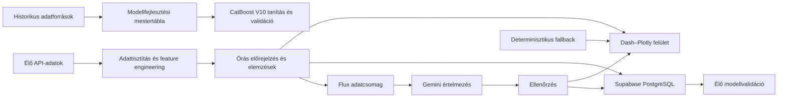

OkosMérő
Automatizált villamosenergia-adatelemző, fogyasztás-előrejelző és energiapiaci döntéstámogató rendszer
Az OkosMérő az MVM DataInsight diplomamunkából továbbfejlesztett, nyilvánosan elérhető energiadat-platform. A rendszer több külső adatforrásból származó fogyasztási, energiapiaci, időjárási, árfolyam- és megújulóenergia-adatot integrál, majd ezekből órás fogyasztási előrejelzést, day-ahead árelemzést, megújulóenergia-monitoringot és anomáliavizsgálatot készít.
A projekt nem egyszeri modellkísérlet, hanem teljes adat- és alkalmazási folyamat: a historikus adatok feldolgozásától és a modellfejlesztéstől az élő API-kapcsolatokon át az előrejelzések tartós tárolásáig, visszaméréséig és közérthető értelmezéséig.
Élő alkalmazás
https://okosmero.onrender.com
Fő képességek
órás villamosenergia-fogyasztási előrejelzés CatBoost modellel;
CatBoost- és MAVIR-előrejelzések folyamatos összehasonlítása;
negyedórás day-ahead villamosenergiaárak elemzése;
kedvező, összefüggő töltési időszakok azonosítása;
nap- és szélerőművi előrejelzések összevetése a mért termeléssel;
STL-alapú anomáliadetektálás és kontextusalapú kategorizálás;
napi és heti élő modellvalidáció;
Supabase PostgreSQL-alapú előrejelzési és anomálianapló;
többforrású adatlekérés, gyorsítótárazás és tartalék adatforrások;
Flux intelligens asszisztens az élő eredmények természetes nyelvű értelmezéséhez.
Rendszerarchitektúra
Az OkosMérő három, egymástól világosan elkülönített adatrétegre épül.

1. Historikus modelladatbázis
A modell fejlesztéséhez használt historikus adatállomány automatizált Python-adatpipeline-nal készült.
A 2015–2026 közötti ENTSO-E terhelési lekérés több mint 400 000 nyers negyedórás időpontot eredményezett. A tisztítás, időzóna-egységesítés, duplikációkezelés és órás aggregálás után létrejött modellfejlesztési mestertábla:
100 549 órás rekordot;
21 alapváltozót
tartalmaz.
A historikus adatréteg fő forrásai
Forrás	Felhasználás
ENTSO-E Transparency Platform	fogyasztás, day-ahead árak, nap- és szélenergia-adatok
Open-Meteo	historikus órás időjárási adatok
ECB	EUR/HUF árfolyam
Magyar ünnepnap-adatok	naptári és ünnepnapi jellemzők
A mestertábla a modell tanítását, feature engineeringjét és offline validációját szolgálja. Nem azonos az alkalmazás működése közben folyamatosan frissülő élő adatfolyammal.
2. Élő adatpipeline
Az éles alkalmazás minden frissítési ciklusban közvetlenül lekéri a működéshez szükséges aktuális adatokat.
A rendszer automatikusan kezeli:
a magyar villamosenergia-rendszer mért terhelését;
a hivatalos terhelési előrejelzést;
a publikált day-ahead villamosenergiaárakat;
a nap- és szélerőművi termelési előrejelzéseket;
a mért nap- és széltermelést;
az órás időjárási adatokat;
az EUR/HUF árfolyamot;
a naptári és ünnepnapi információkat.
Az élő adatfolyam fő lépései
API-adatok lekérése;
időpontok egységesítése Europe/Budapest időzónára;
adatelérhetőség és adatminőség ellenőrzése;
a modell bemeneti jellemzőinek előállítása;
órás előrejelzés és elemzések elkészítése;
a Dash-felület frissítése;
az előrejelzések mentése;
visszamérés a lezárt tényadatok beérkezése után.
3. Operatív Supabase PostgreSQL-adatbázis
A Supabase PostgreSQL nem a historikus tanítási mestertábla helyettesítője. Az éles rendszer működését, visszamérését és auditálhatóságát biztosítja.
`forecast_pending`
A még jövőbeli célórákhoz tartozó előrejelzéseket tárolja.
Célóránként megőrzi többek között:
az első CatBoost-jóslatot;
a legfrissebb CatBoost-jóslatot;
az előrejelzés időpontját és horizontját;
a MAVIR-előrejelzést;
a modellverziót;
a bemeneti adatok minőségi állapotát;
az adatforrás típusát.
`forecast_log`
A lezárt órák végleges validációs rekordjait tartalmazza.
Egy célóra akkor kerül a végleges naplóba, amikor rendelkezésre áll:
a korábban mentett CatBoost-előrejelzés;
a MAVIR-előrejelzés;
a lezárt tényleges fogyasztási adat.
A rendszer ekkor kiszámítja:
a CatBoost abszolút hibáját;
a MAVIR abszolút hibáját;
az első CatBoost-jóslat hibáját;
a legfrissebb CatBoost-jóslat hibáját.
A lezárt rekordok utólag nem módosulnak, így az éles teljesítmény időben követhető és auditálható.
`stl_anomalia`
Az STL-módszerrel azonosított eltéréseket és azok magyarázó környezetét tárolja, például:
tényleges és várt fogyasztás;
reziduum;
hőmérséklet;
szélsebesség;
napsugárzás;
csapadék;
day-ahead ár;
napszak;
hétvége- és ünnepnapjelző;
anomáliakategória.
Fogyasztás-előrejelzés
CatBoost V10
Az éles rendszer fogyasztás-előrejelző modellje a CatBoost V10.
A modell közvetlenül készít órás előrejelzéseket: nem a saját korábbi jóslatát használja a következő célóra bemeneteként. A rendelkezésre álló élő forrásadatoktól függően legfeljebb 24 órás előrejelzési horizontot állít elő.
A modell többek között az alábbi jellemzőcsoportokat használja.
Fogyasztási előzmények
24, 48, 72, 96, 120, 144, 168 és 336 órás késleltetések;
az előző hetek azonos óráinak átlaga, mediánja, minimuma és maximuma;
rövid és heti fogyasztási trendek.
Időjárási jellemzők
hőmérséklet;
páratartalom;
napsugárzás;
szélsebesség;
csapadék;
fűtési és hűtési fokértékek.
Energiapiaci és megújulóenergia-jellemzők
day-ahead ár;
árkülönbségi jellemzők;
napenergia-előrejelzés;
szélenergia-előrejelzés;
EUR/HUF árfolyam.
Idő- és naptárjellemzők
óra;
hét napja;
hónap;
hétvége;
ünnepnap;
napi, heti és éves ciklikus jellemzők;
extrém hideg- és melegjelzők.
Offline validáció
A kiválasztott CatBoost V10 modell kódban rögzített eredménye:
Mutató	CatBoost V10
MAE	108,48 MWh
MAPE	2,50%
Ugyanezen referencia-időszakban a hivatalos MAVIR napelőtti előrejelzés MAE-je 244,45 MWh volt.
A dokumentáció kizárólag a kiválasztott éles modell ellenőrzött eredményeit mutatja be; az elvetett köztes modellváltozatok nem részei a rendszerleírásnak.
Élő validáció
Az offline értékelést folyamatos éles visszamérés egészíti ki.
Az operatív adatbázis alapján az alkalmazás megjeleníti:
a napi CatBoost MAE-t;
a napi MAVIR MAE-t;
a heti kumulált hibákat;
a CatBoost–MAVIR nyerési arányt;
a legjobb és legnehezebb előrejelzési órát;
az első és a legfrissebb CatBoost-jóslat eredményét.
STL-alapú anomáliadetektálás
Az OkosMérő robusztus STL-dekompozícióval bontja fel a fogyasztási idősort:
hosszabb távú trendre;
napi szezonális mintázatra;
reziduumra.
A rendszer a ±2,5 szórásos küszöbön kívül eső reziduumokat anomáliaként kezeli.
Az eltéréseket a rendelkezésre álló időjárási és energiapiaci környezet alapján kategorizálja:
időjárási extrém;
alacsony napsugárzáshoz kapcsolódó nappali eltérés;
jelentős, 24 órán belüli hőmérsékleti fordulat;
további vizsgálatot igénylő eltérés.
Az anomáliák a felületen és a Supabase-adatbázisban egyaránt megjelennek.
Flux – élő adatokra épülő intelligens asszisztens
Flux az OkosMérő új főoldalán működő intelligens értelmezési réteg. Feladata, hogy a rendszer technikai eredményeit közérthető, természetes nyelvű összefoglalókká alakítsa, és válaszoljon az alkalmazás adataival kapcsolatos kérdésekre.
Flux képes:
bemutatni az OkosMérő célját és fő funkcióit;
összefoglalni az aktuális fogyasztási előrejelzést;
értelmezni a day-ahead árakat és a töltési ajánlást;
bemutatni a nap- és szélerőművi előrejelzések eredményeit;
összefoglalni az STL-anomáliavizsgálat megállapításait;
válaszolni az aktuális adatokkal és a rendszer működésével kapcsolatos kérdésekre;
szélsőséges időjárás és magas várható terhelés esetén rövid, tárgyilagos figyelmeztetést adni.
Élő adatokon alapuló válaszadás
Flux nem előre eltárolt válaszokból és nem a Supabase-adatbázisból állítja elő a felhasználói válaszokat.
A kérdés pillanatában a Gemini strukturált adatcsomagban kapja meg az OkosMérő aktuális eredményeit, például:
a mért és előrejelzett fogyasztást;
a CatBoost- és MAVIR-előrejelzéseket;
a day-ahead árakat;
a töltési ajánlást;
a nap- és szélerőművi adatokat;
az anomáliavizsgálat eredményeit;
az adatforrások elérhetőségi és minőségi állapotát.
A nyelvi modell kizárólag az átadott adatcsomag alapján készíthet választ.
Gyorsítótárazás
A Supabase ebben a folyamatban gyorsítótárként és auditnaplóként működik.
Minden adatállapot egyedi azonosítót kap. Ha ugyanahhoz az adatállapothoz már készült érvényes összefoglaló, a rendszer azt használja fel új Gemini-hívás helyett.
Ennek előnye:
alacsonyabb API-költség;
gyorsabb válaszidő;
kevesebb ismételt modellhívás;
azonos adatokhoz következetes válasz.
Auditálható szöveggenerálás
Minden generált összefoglalóhoz rögzíthető:
a generálás időpontja;
az alapul szolgáló adatállapot azonosítója;
a használt modell;
a prompt verziója;
a válasz típusa;
az ellenőrzés eredménye;
a generálás státusza.
A lehetséges státuszok:
`gemini` – a Gemini által készített és elfogadott válasz;
`fallback` – determinisztikus sablonból készült válasz;
`rejected` – az ellenőrzésen elutasított modellválasz.
Determinisztikus hibatűrés
A Gemini válasza csak akkor jelenhet meg, ha megfelel az ellenőrzési szabályoknak.
Ha a modell:
nem érhető el;
túllépi az időkorlátot;
hibás vagy nem ellenőrizhető választ ad;
olyan számot használ, amely nincs jelen az adatcsomagban,
a generált válasz nem kerül a felületre.
Ilyenkor determinisztikus, az élő adatokból programozott szabályokkal összeállított fallback szöveg jelenik meg. Ez biztosítja, hogy az oldal Gemini nélkül is használható maradjon, és kitalált adat ne kerülhessen a felhasználó elé.
Flux így nem egyszerű chatbot, hanem az OkosMérő ellenőrzött adataira épülő, gyorsítótárazott, auditálható és hibatűrő természetes nyelvű értelmezési réteg.
Alkalmazásfelületek
Főoldal
A megújuló főoldal:
bemutatja az OkosMérő működését;
megjeleníti a legfontosabb aktuális mutatókat;
Flux segítségével közérthető összefoglalót ad;
hozzáférést biztosít az élő adatokkal kapcsolatos kérdésekhez.
DAM-árak és töltés
A day-ahead árak alapján támogatja a töltési döntést:
negyedórás árak megjelenítése;
kedvező, összefüggő töltési időszak kiválasztása;
negatív árú időszakok felismerése;
alternatív töltési ablakok ajánlása.
Energiaelemzés
Megjeleníti:
az órás CatBoost-előrejelzést;
a hivatalos MAVIR-előrejelzést;
a várható minimum- és csúcsterhelést;
a fogyasztás és a hőmérséklet kapcsolatát;
a napi és heti élő validációs eredményeket.
Megújulók
A megújulóenergia-modul:
összehasonlítja a napenergia-előrejelzést a mért termeléssel;
összehasonlítja a szélenergia-előrejelzést a mért termeléssel;
kiszámítja az aktuális előrejelzési hibákat;
megjeleníti a várható termelési csúcsokat;
összekapcsolja a megújuló termelést a day-ahead árakkal.
ML Modell Labor
A modell-labor tartalmazza:
az STL-reziduum grafikonját;
az anomáliaküszöböket;
a kategorizált anomáliákat;
az anomáliák időjárási és energiapiaci hátterét;
az adatminőségi állapotot;
az anomálianaplót.
Adatminőség és hibatűrés
Az OkosMérő:
Europe/Budapest időzónában kezeli az adatokat;
csak teljesen lezárt órát használ tényadatként;
adatforrásonként külön gyorsítótárat alkalmaz;
új nap és day-ahead publikálás után érvényteleníti az elavult gyorsítótárat;
Open-Meteo-hiba esetén Visual Crossing tartalékforrásra válthat;
átmeneti API-hiba esetén az utolsó sikeresen lekért valós adatot használhatja;
megkülönbözteti a teljes, részleges és kritikus adatkapcsolati állapotot;
nem állít elő kitalált helyettesítő adatot;
automatikus és kézi frissítést is biztosít.
Fejlődési út: MVM DataInsight → OkosMérő
Az OkosMérő nem az eredeti diplomamunka egyszerű átnevezése, hanem annak módszertanilag felülvizsgált és jelentősen kibővített utódja.
MVM DataInsight – napi és havi adatkészletek
Az eredeti rendszer eltérő formátumú, nyilvános Excel- és CSV-forrásállományokból felépített napi és havi adatkészletekkel dolgozott.
Négy fő mestertábla készült:
Adatkészlet	Időszak	Rekordszám
Havi országos villamosenergia-felhasználás	2014–2024	132 havi rekord
Lakossági fogyasztás és rezsi-gap	2014–2024	132 havi rekord
Napi országos fogyasztás	2024–2025	731 napi rekord
Napi HUPX DAM-ár	2024–2025	731 napi rekord
A predikciós mestertábla a napi fogyasztási és DAM-adatok dátum szerinti összekapcsolásával készült, majd 2026 eleji fogyasztási, időjárási, energiapiaci és naptári adatokkal bővült.
Az eredeti rendszer adattárolási technológiája Azure Database for PostgreSQL volt.
Anomáliadetektálás és trendelemzés
Az eredeti elemzési modul több módszert kapcsolt össze:
szezonálisan értelmezett IQR;
Isolation Forest;
Random Forest osztályozó;
SMOTE a kisebbségi osztály kiegyensúlyozására;
precision-, recall- és F1-alapú értékelés;
konfúziós mátrix;
több módszer közös találatainak vizsgálata.
A trendelemzés többek között a rezsi-gap, az energiaár-olló, a HUPX- és ENTSO-E-árak, az ECB EUR/HUF árfolyam, a KSH háztartásszám-adatok, valamint a hőmérséklet és fogyasztás kapcsolatát vizsgálta.
PyTorch V1, V2 és kapuzott ensemble
A napi predikciós mestertábla 2026 eleji adatokkal 790 rekordra bővült.
Az első előrejelző modell egy PyTorch neurális háló volt:
9 bemeneti változó;
64 és 32 neuronos rejtett rétegek;
ReLU aktiváció;
MinMaxScaler;
Adam-optimalizáló;
MSE-veszteség;
200 tanítási epoch.
A célzott hibaanalízis kimutatta, hogy a tanítóhalmazban kevés −5 °C alatti nap szerepelt. Ennek kezelésére 30 adatvezérelt szintetikus extrémhideg-rekord készült:
15 rekord −5 és −7 °C között;
15 rekord −7 és −10 °C között.
A szintetikus minták a valós téli adatok hőmérsékleti sávonként számított fogyasztási átlagaira épültek.
A V2 modell a bővített tanítóhalmazon készült. A két modell erősségeit szabályalapú kapuzott ensemble kapcsolta össze:
−5 °C alatt a V2;
−5 °C felett a V1
adta az előrejelzést.
A modellek értékelését naiv baseline-ok, SARIMA és SHAP DeepExplainer egészítette ki.
Módszertani felülvizsgálat
A későbbi validáció adatszivárgást tárt fel az eredeti predikciós felállásban. Emiatt a korai, rendkívül magas pontossági eredmények nem használhatók a jelenlegi rendszer teljesítményének igazolására.
A vizsgálatok között szerepelt:
időbeli shift-teszt;
feature-megvonási teszt;
loss-görbék összehasonlítása;
SHAP-változófontosság;
bootstrap konfidenciaintervallum;
Diebold–Mariano-teszt;
walk-forward validáció;
multi-seed stabilitásvizsgálat.
Ez a módszertani felülvizsgálat vezetett az előrejelzési folyamat időben helyes újratervezéséhez.
CrewAI-alapú automatizáció
Az MVM DataInsight negyedik modulja saját CrewAI-eszközökkel és adatgyűjtő ágensekkel működött.
A két fő ágens:
Időjárás Adatgyűjtő – Open-Meteo-adatokkal;
Energiatőzsdei Adatgyűjtő – ENTSO-E day-ahead adatokkal.
A rendszer külön Agenteket, Taskokat és szekvenciális Crew-folyamatot használt, gpt-4o-mini nyelvi modellel.
Az eredeti alkalmazás Streamlit-felülettel, GitHub-verziókezeléssel és Render deploymenttel működött.
A jelenlegi rendszer fő előrelépései
napi helyett órás modellezés;
790 rekord helyett 100 549 órás rekordból álló historikus mestertábla;
automatizált ENTSO-E-adatlekérés;
külön élő adatpipeline;
CatBoost V10 éles modell;
folyamatos CatBoost–MAVIR összehasonlítás;
Supabase PostgreSQL operatív adatbázis;
Dash–Plotly webalkalmazás;
tartós előrejelzési és anomálianapló;
forrásállapot- és adatminőség-kezelés;
Flux természetes nyelvű értelmezési réteg.
Technológiai háttér
Éles rendszer
Python · pandas · NumPy · CatBoost · Dash · Dash Bootstrap Components · Plotly · statsmodels · STL · ENTSO-E · Open-Meteo · Visual Crossing · ECB · Supabase PostgreSQL · psycopg · joblib · requests · Gunicorn · Render
Kutatási és fejlesztési előzmények
PyTorch · scikit-learn · Random Forest · Isolation Forest · SMOTE · XGBoost · LightGBM · FLAML AutoML · SARIMA · ensemble-modellek · SHAP DeepExplainer · bootstrap konfidenciaintervallum · Diebold–Mariano-teszt · walk-forward validáció · multi-seed validáció · CrewAI · Streamlit · Azure Database for PostgreSQL
Helyi futtatás
Függőségek telepítése
```bash
pip install -r requirements.txt
```
Környezeti változók
```env
ENTSOE_API_KEY=...
VISUAL_CROSSING_KEY=...
DATABASE_URL=...
```
`ENTSOE_API_KEY`: ENTSO-E adatlekérések;
`VISUAL_CROSSING_KEY`: tartalék időjárási adatforrás;
`DATABASE_URL`: Supabase PostgreSQL-kapcsolat.
A `DATABASE_URL` hiányában az alkalmazás futtatható, de az előrejelzési és anomálianaplózás kimarad.
Fejlesztői indítás
```bash
python app.py
```
Az alkalmazás alapértelmezetten a 8050 porton indul.
Éles indítás
```bash
gunicorn app:server
```
AI-native fejlesztési megközelítés
A projekt AI-native fejlesztési munkafolyamatban készült. A rendszertervezési döntések, az adatforrások kiválasztása, a modellezési követelmények, a validációs szabályok, a felhasználói funkciók és a javítási irányok emberi döntések alapján születtek.
Az implementáció részletes promptutasításokkal, iteratív fejlesztéssel, teszteléssel és ellenőrzéssel valósult meg.
Az MI-támogatás a következő területeket segítette:
adatfeldolgozó és API-integrációs kód létrehozása;
feature engineering;
modellkísérletek és validáció;
alkalmazáslogika;
adatbázis-integráció;
hibakeresés;
dokumentáció.
Az éles adatlekéréseket nem egy nyelvi modell végzi: a Python-alkalmazás közvetlenül kapcsolódik a külső API-khoz. A nyelvi modell a Flux-rétegben kizárólag az alkalmazás által átadott, ellenőrzött adatcsomag természetes nyelvű értelmezésére szolgál.
Projektstátusz
Az OkosMérő működő, nyilvánosan elérhető portfólióprojekt.
A rendszer jelenleg:
automatikusan lekéri és feldolgozza az élő energiarendszeri adatokat;
100 549 órás historikus mestertáblára épül;
CatBoost V10 modellel órás fogyasztási előrejelzést készít;
day-ahead árakat és töltési lehetőségeket elemez;
nap- és széltermelési előrejelzéseket értékel;
STL-alapú anomáliákat azonosít;
Supabase PostgreSQL-adatbázisban naplózza az előrejelzéseket és hibákat;
a modell eredményét folyamatosan összehasonlítja a tényleges fogyasztással és a hivatalos MAVIR-előrejelzéssel;
az új főoldalon működő Flux intelligens asszisztenssel közérthetően összefoglalja az aktuális eredményeket, és válaszol az élő adatokkal, valamint a rendszer működésével kapcsolatos kérdésekre;
a Gemini által készített szövegeket adatállapot-alapú Supabase-gyorsítótárral, modell- és promptverziózott auditnaplóval, tartalmi ellenőrzéssel és determinisztikus fallbackkel kezeli.
